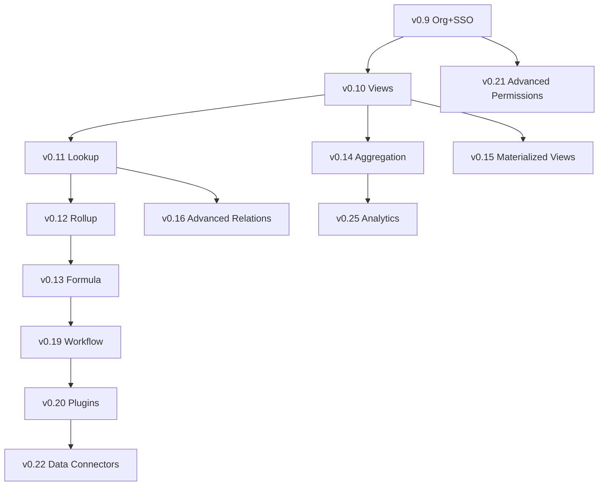

# MorphDB Extended Roadmap: v0.9.x ~ v0.30.x

> **Philosophy Alignment**: 모든 기능은 MorphDB의 핵심 철학을 준수합니다.
> - **Logical-Physical Abstraction**: 사용자는 논리명, 시스템은 물리명
> - **Runtime Flexibility**: 스키마 변경 시 데이터 마이그레이션 불필요
> - **Virtual Constraints**: 애플리케이션 레이어에서 유연한 제약 조건
> - **Write Pipeline**: Transformers → Validators → Executor 패턴

---

## Version Overview

| Version | Theme | Key Features | Effort |
|---------|-------|--------------|--------|
| 0.9.x | Organization + SSO | Teams, RBAC, OIDC/SAML | High |
| 0.10.x | Views | Virtual tables, computed columns | Medium |
| 0.11.x | Lookup Fields | Cross-table field reference | Medium |
| 0.12.x | Rollup Fields | Aggregation on relations | Medium |
| 0.13.x | Formula Fields | Expression evaluation | High |
| 0.14.x | Aggregation API | Count, sum, avg, min, max | Medium |
| 0.15.x | Materialized Views | Cached query results | High |
| 0.16.x | Advanced Relations | Many-to-many, self-referential | Medium |
| 0.17.x | File Attachments | S3/Azure Blob integration | Medium |
| 0.18.x | Full-Text Search | PostgreSQL tsvector | High |
| 0.19.x | Workflow Automation | Triggers, actions | Very High |
| 0.20.x | Plugin Architecture | Extension points | Very High |
| 0.21.x | Advanced Permissions | Field-level, conditional | High |
| 0.22.x | Data Connectors | External data sources | High |
| 0.23.x | Admin Dashboard | Web UI | Very High |
| 0.24.x | Enterprise Features | HA, Backup, PITR | Very High |
| 0.25.x | Analytics & BI | Dashboards, charts | High |
| 0.26.x | Multi-Region | Geo-replication | Very High |
| 0.27.x | Edge Functions | Serverless compute | Very High |
| 0.28.x | API Gateway | Rate limiting, caching | High |
| 0.29.x | Compliance Pack | SOC2, GDPR, HIPAA | High |
| 0.30.x | Pre-1.0 Hardening | Stability, performance | High |

---

## Phase Details

### v0.9.x: Organization + SSO (Planned)

> 이미 ROADMAP.md에 정의됨. Phase 21-22.

| Task | Priority | Description |
|------|----------|-------------|
| Organization Entity | 🔴 Critical | Org → Projects → Environments 계층 |
| RBAC Implementation | 🔴 Critical | enterprise_admin, org_admin, project_admin, developer, viewer |
| OIDC Provider Support | 🟡 High | Google, Microsoft, Auth0, Okta |
| SAML 2.0 | 🟡 High | Okta, Azure AD, ADFS |
| JIT Provisioning | 🟢 Normal | Just-in-time user creation |

---

### v0.10.x: Views & Computed Columns

> **철학 정렬**: View는 논리적 추상화의 확장. 물리 테이블 없이 가상 테이블 제공.

#### 핵심 개념

```
┌─────────────────────────────────────────────────────────────┐
│                    MorphDB Views                             │
│                                                              │
│  1. Standard View: 쿼리 기반 가상 테이블                      │
│  2. Computed Column: 테이블 내 가상 컬럼                      │
│  3. Generated Column: 저장된 계산 컬럼 (PostgreSQL 기반)     │
└─────────────────────────────────────────────────────────────┘
```

#### Architecture

```
ViewMetadata (morphdb._morph_views)
├── view_id: UUID
├── tenant_id: UUID
├── logical_name: string (사용자 표시명)
├── physical_name: string (view_{hash})
├── definition: JSON {
│     base_tables: string[],
│     joins: JoinSpec[],
│     columns: ColumnSpec[],
│     filters: FilterSpec[]
│   }
├── is_materialized: boolean
└── refresh_policy: string (on_demand | scheduled | real_time)
```

#### Implementation Tasks

| Task | Priority | Description |
|------|----------|-------------|
| View Metadata Schema | 🔴 Critical | `_morph_views` system table |
| View DDL Builder | 🔴 Critical | CREATE VIEW with logical→physical translation |
| View Query Engine | 🔴 Critical | View를 일반 테이블처럼 쿼리 |
| Computed Column Type | 🟡 High | ColumnMetadata에 `computed_expression` 추가 |
| Generated Column Support | 🟡 High | PostgreSQL GENERATED ALWAYS AS |
| GraphQL View Integration | 🟡 High | View를 GraphQL type으로 노출 |
| OData View Support | 🟢 Normal | $metadata에 View 포함 |
| View API Endpoints | 🟢 Normal | CRUD for view definitions |

#### API Design

```http
# View 생성
POST /api/schema/views
{
  "name": "active_orders",
  "baseTables": ["orders"],
  "columns": [
    { "source": "orders.id", "alias": "order_id" },
    { "source": "orders.total", "alias": "amount" },
    { "expression": "orders.total * 1.1", "alias": "with_tax", "type": "computed" }
  ],
  "filter": { "field": "status", "op": "eq", "value": "active" }
}

# Computed Column 추가
POST /api/schema/tables/{table}/columns
{
  "name": "full_name",
  "type": "text",
  "computed": {
    "expression": "CONCAT(first_name, ' ', last_name)",
    "stored": false  // virtual (computed on read)
  }
}
```

---

### v0.11.x: Lookup Fields

> **철학 정렬**: 관계형 데이터의 편리한 참조. Airtable/Notion 스타일의 Lookup.

#### 핵심 개념

```
Lookup Field = Foreign Key Reference + 자동 필드 조회

orders.customer_id → customers._id
orders.customer_name (lookup) → customers.name
```

#### Architecture

```
ColumnMetadata 확장
{
  "name": "customer_name",
  "type": "lookup",
  "lookup_config": {
    "relation": "customer_id",        // FK 컬럼
    "target_table": "customers",       // 참조 테이블
    "target_column": "name",           // 가져올 컬럼
    "on_delete": "set_null"            // 참조 삭제 시 동작
  }
}
```

#### Implementation Tasks

| Task | Priority | Description |
|------|----------|-------------|
| Lookup Column Type | 🔴 Critical | `MorphDataType.Lookup` 추가 |
| Lookup Config Schema | 🔴 Critical | ColumnMetadata에 lookup 설정 |
| Query Expansion | 🔴 Critical | SELECT 시 자동 JOIN 생성 |
| Real-time Sync | 🟡 High | 참조 데이터 변경 시 알림 |
| Multi-Column Lookup | 🟢 Normal | 여러 컬럼 동시 조회 |
| Chained Lookup | 🟢 Normal | A→B→C 체이닝 지원 |

#### Query Transformation

```sql
-- 사용자 쿼리 (논리적)
SELECT id, customer_name FROM orders

-- 변환된 쿼리 (물리적)
SELECT
  o.col_xxx AS id,
  c.col_yyy AS customer_name
FROM tbl_orders o
LEFT JOIN tbl_customers c ON o.col_customer_id = c.col_id
```

---

### v0.12.x: Rollup Fields

> **철학 정렬**: 관계 기반 집계. 1:N 관계의 N측 데이터 집계.

#### 핵심 개념

```
Rollup = Relation + Aggregation Function

customers._id ← orders.customer_id (1:N)
customers.total_orders (rollup) = COUNT(orders)
customers.total_spent (rollup) = SUM(orders.amount)
```

#### Supported Aggregations

| Function | Description | Types |
|----------|-------------|-------|
| `COUNT` | 레코드 수 | All |
| `SUM` | 합계 | Number, Decimal |
| `AVG` | 평균 | Number, Decimal |
| `MIN` | 최소값 | Number, Date, Text |
| `MAX` | 최대값 | Number, Date, Text |
| `ARRAY_AGG` | 배열로 수집 | All |
| `STRING_AGG` | 문자열 연결 | Text |
| `PERCENT_CHECKED` | 체크박스 비율 | Boolean |

#### Architecture

```
ColumnMetadata 확장
{
  "name": "total_orders",
  "type": "rollup",
  "rollup_config": {
    "relation": "orders",              // 관련 테이블
    "foreign_key": "customer_id",      // FK 컬럼
    "aggregation": "COUNT",            // 집계 함수
    "source_column": "*",              // 집계 대상 (COUNT는 *)
    "filter": { "status": "completed" } // 선택적 필터
  }
}
```

#### Implementation Tasks

| Task | Priority | Description |
|------|----------|-------------|
| Rollup Column Type | 🔴 Critical | `MorphDataType.Rollup` 추가 |
| Aggregation Functions | 🔴 Critical | 기본 집계 함수 구현 |
| Query Generation | 🔴 Critical | 서브쿼리/JOIN 기반 집계 |
| Cached Rollup | 🟡 High | 성능 최적화를 위한 캐싱 |
| Incremental Update | 🟡 High | 변경 시 증분 업데이트 |
| Rollup with Filter | 🟢 Normal | 조건부 집계 |

---

### v0.13.x: Formula Fields

> **철학 정렬**: 표현식 기반 계산 필드. Airtable/Notion Formula 스타일.

#### Expression Language

```javascript
// 기본 연산
total * 1.1                              // 산술
CONCAT(first_name, " ", last_name)       // 문자열
IF(status == "active", "Yes", "No")      // 조건
DATEADD(created_at, 30, "day")           // 날짜

// 관계 참조
customer.name                            // Lookup 참조
ROLLUP(orders, SUM, amount)              // 인라인 Rollup
```

#### Formula AST

```
FormulaDefinition
├── expression: string (원본 수식)
├── ast: ExpressionNode (파싱된 AST)
├── return_type: MorphDataType
├── dependencies: string[] (참조 컬럼)
└── is_volatile: boolean (NOW() 등 포함 시)
```

#### Built-in Functions

| Category | Functions |
|----------|-----------|
| Math | `ABS`, `ROUND`, `FLOOR`, `CEIL`, `POWER`, `SQRT`, `MOD` |
| Text | `CONCAT`, `LEFT`, `RIGHT`, `MID`, `LEN`, `UPPER`, `LOWER`, `TRIM`, `REPLACE` |
| Date | `NOW`, `TODAY`, `DATEADD`, `DATEDIFF`, `YEAR`, `MONTH`, `DAY`, `FORMAT_DATE` |
| Logic | `IF`, `SWITCH`, `AND`, `OR`, `NOT`, `COALESCE`, `NULLIF` |
| Array | `ARRAY_JOIN`, `ARRAY_CONTAINS`, `ARRAY_LENGTH`, `ARRAY_FIRST`, `ARRAY_LAST` |
| Aggregate | `ROLLUP`, `LOOKUP` |

#### Implementation Tasks

| Task | Priority | Description |
|------|----------|-------------|
| Expression Parser | 🔴 Critical | Formula 문법 파서 (ANTLR/Parlot) |
| AST Evaluator | 🔴 Critical | 런타임 수식 평가 |
| SQL Transpiler | 🔴 Critical | Formula → PostgreSQL SQL 변환 |
| Type Inference | 🟡 High | 자동 반환 타입 추론 |
| Function Library | 🟡 High | 내장 함수 라이브러리 |
| Formula Validation | 🟡 High | 순환 참조, 타입 오류 검증 |
| Formula Caching | 🟢 Normal | 파싱 결과 캐싱 |

---

### v0.14.x: Aggregation API

> **철학 정렬**: Firebase/Supabase 스타일의 서버사이드 집계.

#### API Design

```http
# 집계 쿼리
POST /api/data/{table}/aggregate
{
  "aggregations": [
    { "function": "COUNT", "alias": "total" },
    { "function": "SUM", "column": "amount", "alias": "total_amount" },
    { "function": "AVG", "column": "rating", "alias": "avg_rating" }
  ],
  "groupBy": ["status", "category"],
  "filter": { "created_at": { "$gte": "2024-01-01" } }
}

# 응답
{
  "data": [
    { "status": "active", "category": "A", "total": 150, "total_amount": 45000, "avg_rating": 4.5 },
    { "status": "active", "category": "B", "total": 89, "total_amount": 23400, "avg_rating": 4.2 }
  ]
}
```

#### GraphQL Integration

```graphql
query {
  orders_aggregate(
    where: { status: { _eq: "completed" } }
    group_by: [category]
  ) {
    aggregate {
      count
      sum { amount }
      avg { rating }
    }
    nodes {
      category
    }
  }
}
```

#### Implementation Tasks

| Task | Priority | Description |
|------|----------|-------------|
| Aggregation Query Builder | 🔴 Critical | SQL 집계 쿼리 생성 |
| REST Aggregation Endpoint | 🔴 Critical | `/api/data/{table}/aggregate` |
| GraphQL _aggregate Type | 🟡 High | HotChocolate 집계 타입 |
| OData $apply Support | 🟡 High | OData 집계 쿼리 |
| Aggregation Caching | 🟢 Normal | 자주 사용되는 집계 캐싱 |

---

### v0.15.x: Materialized Views

> **철학 정렬**: PostgreSQL Materialized View 활용한 쿼리 성능 최적화.

#### Architecture

```
MaterializedViewMetadata
├── view_id: UUID
├── definition: ViewDefinition
├── refresh_policy: {
│     type: "manual" | "scheduled" | "incremental",
│     schedule: "0 * * * *",  // cron (scheduled)
│     triggers: string[]       // 트리거 테이블 (incremental)
│   }
├── last_refreshed: timestamp
└── is_stale: boolean
```

#### Refresh Strategies

| Strategy | Use Case | Implementation |
|----------|----------|----------------|
| Manual | 명시적 새로고침 | `REFRESH MATERIALIZED VIEW` |
| Scheduled | 정기적 업데이트 | Background job (Hangfire) |
| Incremental | 실시간 근접 | PostgreSQL triggers + partial refresh |
| Concurrent | 무중단 새로고침 | `REFRESH CONCURRENTLY` (unique index 필요) |

#### Implementation Tasks

| Task | Priority | Description |
|------|----------|-------------|
| Materialized View DDL | 🔴 Critical | CREATE MATERIALIZED VIEW |
| Refresh Management | 🔴 Critical | 새로고침 API 및 스케줄링 |
| Staleness Detection | 🟡 High | 기반 테이블 변경 감지 |
| Concurrent Refresh | 🟡 High | 무중단 새로고침 지원 |
| Incremental Refresh | 🟢 Normal | 증분 새로고침 (고급) |

---

### v0.16.x: Advanced Relations

> **철학 정렬**: 복잡한 관계 모델링. M:N, 자기 참조, 다형성 관계.

#### Relation Types

| Type | Description | Implementation |
|------|-------------|----------------|
| One-to-Many | 기본 FK 관계 | 기존 구현 |
| Many-to-Many | Junction 테이블 자동 | 자동 생성 junction table |
| Self-Referential | 계층 구조 | parent_id → same table |
| Polymorphic | 다형성 참조 | entity_type + entity_id |

#### Many-to-Many API

```http
POST /api/schema/relations
{
  "type": "many_to_many",
  "tables": ["students", "courses"],
  "junction": {
    "name": "enrollments",  // 옵션: 자동 생성 시 생략
    "extra_columns": [
      { "name": "enrolled_at", "type": "timestamp" },
      { "name": "grade", "type": "text" }
    ]
  }
}
```

#### Self-Referential (Hierarchy)

```http
POST /api/schema/columns
{
  "name": "parent_id",
  "type": "uuid",
  "relation": {
    "type": "self_referential",
    "on_delete": "set_null"
  }
}

# 쿼리 지원
GET /api/data/categories/{id}/ancestors
GET /api/data/categories/{id}/descendants
GET /api/data/categories/tree
```

---

### v0.17.x: File Attachments

> **철학 정렬**: 파일을 데이터베이스 레코드와 연결. 스토리지는 외부(S3, Azure).

#### Architecture

```
┌─────────────────────────────────────────────────────────────┐
│                    MorphDB Service                           │
│  FileController    AttachmentService    StorageProvider      │
└─────────────────────────────────────────────────────────────┘
                              │
        ┌─────────────────────┼─────────────────────┐
        ▼                     ▼                     ▼
   Amazon S3           Azure Blob            Local Storage
```

#### Attachment Metadata

```
_morph_attachments
├── attachment_id: UUID
├── tenant_id: UUID
├── table_id: UUID
├── record_id: UUID
├── column_name: string
├── file_name: string
├── content_type: string
├── size_bytes: bigint
├── storage_provider: string
├── storage_key: string
├── uploaded_at: timestamp
├── uploaded_by: UUID
└── metadata: JSONB (exif, dimensions, etc.)
```

#### Implementation Tasks

| Task | Priority | Description |
|------|----------|-------------|
| Attachment Column Type | 🔴 Critical | `MorphDataType.Attachment` |
| S3 Storage Provider | 🔴 Critical | AWS S3 통합 |
| Azure Blob Provider | 🟡 High | Azure Blob Storage 통합 |
| Upload/Download API | 🔴 Critical | Multipart upload, presigned URLs |
| Image Transformation | 🟢 Normal | 썸네일, 리사이즈 |
| Virus Scanning | 🟢 Normal | ClamAV 통합 |

---

### v0.18.x: Full-Text Search

> **철학 정렬**: PostgreSQL tsvector 기반 전문 검색.

#### Architecture

```
SearchConfiguration
├── table_id: UUID
├── searchable_columns: string[]
├── language: string (english, korean, etc.)
├── weights: { column: weight }  // A, B, C, D
└── index_type: gin | gist
```

#### API Design

```http
# 전문 검색
GET /api/data/{table}?search=keyword

# 고급 검색
POST /api/data/{table}/search
{
  "query": "database management",
  "fields": ["title", "description"],
  "highlight": true,
  "fuzzy": true
}

# 응답
{
  "data": [...],
  "highlights": {
    "record_id": {
      "title": ["<mark>database</mark> systems"],
      "description": ["efficient <mark>management</mark> of data"]
    }
  }
}
```

#### Implementation Tasks

| Task | Priority | Description |
|------|----------|-------------|
| Search Configuration | 🔴 Critical | 검색 설정 스키마 |
| tsvector Column | 🔴 Critical | 자동 생성/업데이트 |
| GIN Index | 🔴 Critical | 전문 검색 인덱스 |
| Search Query Parser | 🟡 High | 자연어 쿼리 파싱 |
| Highlighting | 🟡 High | 검색 결과 하이라이트 |
| Fuzzy Search | 🟢 Normal | pg_trgm 기반 유사 검색 |

---

### v0.19.x: Workflow Automation

> **철학 정렬**: 데이터 변경 시 자동화된 액션 트리거.

#### Workflow Architecture

```
WorkflowDefinition
├── workflow_id: UUID
├── name: string
├── trigger: {
│     type: "on_create" | "on_update" | "on_delete" | "scheduled",
│     table: string,
│     conditions: FilterSpec[]
│   }
├── actions: [
│     { type: "webhook", config: {...} },
│     { type: "email", config: {...} },
│     { type: "update_record", config: {...} },
│     { type: "create_record", config: {...} }
│   ]
└── is_active: boolean
```

#### Action Types

| Type | Description |
|------|-------------|
| `webhook` | 외부 HTTP 호출 |
| `email` | 이메일 발송 |
| `update_record` | 같은/다른 테이블 레코드 업데이트 |
| `create_record` | 새 레코드 생성 |
| `delete_record` | 레코드 삭제 |
| `send_notification` | 실시간 알림 |
| `run_formula` | 수식 실행 |

#### Implementation Tasks

| Task | Priority | Description |
|------|----------|-------------|
| Workflow Schema | 🔴 Critical | `_morph_workflows` 테이블 |
| Trigger Detection | 🔴 Critical | Write Pipeline 통합 |
| Action Executor | 🔴 Critical | 액션 실행 엔진 |
| Workflow API | 🟡 High | CRUD for workflows |
| Condition Evaluator | 🟡 High | 조건부 트리거 |
| Async Execution | 🟡 High | 비동기 액션 실행 (background) |
| Execution History | 🟢 Normal | 실행 이력 및 디버깅 |

---

### v0.20.x: Plugin Architecture

> **철학 정렬**: 확장 가능한 아키텍처. 커스텀 필드 타입, 액션, 통합.

#### Extension Points

```
┌─────────────────────────────────────────────────────────────┐
│                    Plugin System                             │
├─────────────────────────────────────────────────────────────┤
│  FieldTypePlugin     : 커스텀 필드 타입 정의                  │
│  ValidatorPlugin     : 커스텀 검증 로직                       │
│  TransformerPlugin   : 커스텀 데이터 변환                     │
│  ActionPlugin        : Workflow 액션 확장                    │
│  AuthProviderPlugin  : 인증 제공자 확장                       │
│  StoragePlugin       : 파일 스토리지 확장                     │
└─────────────────────────────────────────────────────────────┘
```

#### Plugin Manifest

```json
{
  "id": "morphdb-plugin-stripe",
  "name": "Stripe Integration",
  "version": "1.0.0",
  "entryPoints": {
    "fieldTypes": ["stripe_customer", "stripe_subscription"],
    "actions": ["create_stripe_customer", "process_payment"],
    "webhooks": ["stripe_webhook_handler"]
  },
  "configuration": {
    "STRIPE_API_KEY": { "type": "secret", "required": true }
  }
}
```

---

### v0.21.x: Advanced Permissions

> **철학 정렬**: 세분화된 접근 제어. PostgreSQL RLS 확장.

#### Permission Model

```
Permission Levels:
├── Organization Level
├── Project Level
├── Table Level
├── Row Level (RLS)
└── Field Level (Column Masking)
```

#### Field-Level Permissions

```http
POST /api/permissions/field
{
  "role": "analyst",
  "table": "users",
  "field": "email",
  "access": "masked",  // none | read | masked | write
  "mask": "***@{domain}"
}
```

#### Conditional Permissions

```http
POST /api/permissions/conditional
{
  "role": "sales_rep",
  "table": "deals",
  "condition": {
    "owner_id": { "$eq": "{{user.id}}" }
  },
  "operations": ["read", "update"]
}
```

---

### v0.22.x: Data Connectors

> **철학 정렬**: 외부 데이터 소스 통합. 가상 테이블로 표현.

#### Supported Connectors

| Connector | Type | Description |
|-----------|------|-------------|
| PostgreSQL | Database | 외부 PostgreSQL 연결 |
| MySQL | Database | MySQL/MariaDB 연결 |
| REST API | API | OpenAPI 스펙 기반 |
| GraphQL | API | GraphQL 엔드포인트 |
| Google Sheets | Spreadsheet | 시트 데이터 동기화 |
| Airtable | BaaS | Airtable base 연동 |

#### Virtual Table

```http
POST /api/connectors
{
  "name": "external_crm",
  "type": "rest_api",
  "config": {
    "base_url": "https://api.crm.com",
    "auth": { "type": "bearer", "token_secret": "CRM_API_KEY" }
  },
  "mappings": [
    {
      "local_table": "crm_contacts",
      "remote_endpoint": "/contacts",
      "sync_mode": "read_write"
    }
  ]
}
```

---

### v0.23.x: Admin Dashboard

> **철학 정렬**: 웹 기반 관리 UI.

#### Dashboard Components

| Component | Description |
|-----------|-------------|
| Schema Explorer | 테이블/컬럼 시각적 관리 |
| Data Browser | 데이터 CRUD UI |
| Query Console | SQL/API 쿼리 실행 |
| API Playground | GraphQL/REST 테스트 |
| User Management | 사용자/역할 관리 |
| Audit Log Viewer | 감사 로그 조회 |
| Metrics Dashboard | 성능/사용량 모니터링 |

#### Tech Stack

```
Frontend: React + TypeScript + TailwindCSS
Components: shadcn/ui
State: TanStack Query
Routing: React Router
```

---

### v0.24.x: Enterprise Features

> **철학 정렬**: 기업 환경 필수 기능.

| Feature | Description |
|---------|-------------|
| High Availability | Primary-Replica 자동 전환 |
| Automated Backup | 정기 백업 및 복구 |
| Point-in-Time Recovery | WAL 기반 PITR |
| Cross-Region Replication | 지역 간 복제 |
| Disaster Recovery | RTO/RPO 보장 |
| SLA Management | 가용성 보장 |

---

### v0.25.x: Analytics & BI

> **철학 정렬**: 내장 분석 도구.

| Feature | Description |
|---------|-------------|
| Dashboard Builder | 드래그앤드롭 대시보드 |
| Chart Types | Bar, Line, Pie, Scatter, Heatmap |
| Scheduled Reports | 정기 리포트 발송 |
| Data Export | CSV, Excel, PDF |
| Embedded Analytics | iframe 임베드 지원 |

---

### v0.26.x: Multi-Region

> **철학 정렬**: 글로벌 배포.

| Feature | Description |
|---------|-------------|
| Geo-Routing | 지역별 자동 라우팅 |
| Data Residency | 지역별 데이터 저장 |
| Edge Caching | CDN 기반 캐싱 |
| Conflict Resolution | Last-Write-Wins / CRDT |

---

### v0.27.x: Edge Functions

> **철학 정렬**: Supabase Edge Functions 스타일.

```typescript
// functions/on-signup.ts
export async function handler(ctx: MorphContext) {
  const { record, table, operation } = ctx.event;

  if (table === 'users' && operation === 'INSERT') {
    await ctx.morphdb.insert('audit_logs', {
      action: 'user_signup',
      user_id: record._id
    });
  }
}
```

---

### v0.28.x: API Gateway

> **철학 정렬**: API 관리 및 보안.

| Feature | Description |
|---------|-------------|
| Rate Limiting | 요청 제한 (기존 확장) |
| Request Caching | 응답 캐싱 |
| Request Transformation | 요청/응답 변환 |
| API Analytics | 사용량 분석 |
| API Versioning | 버전 관리 |

---

### v0.29.x: Compliance Pack

> **철학 정렬**: 규정 준수.

| Standard | Description |
|----------|-------------|
| SOC 2 Type II | 보안 통제 |
| GDPR | 유럽 개인정보보호 |
| HIPAA | 의료정보 보호 |
| PCI DSS | 결제 정보 보안 |
| ISO 27001 | 정보보안 관리 |

---

### v0.30.x: Pre-1.0 Hardening

> **철학 정렬**: 안정성 및 성능 최적화.

| Focus | Description |
|-------|-------------|
| Performance Audit | 성능 병목 해결 |
| Security Audit | 보안 취약점 점검 |
| API Stability | 하위 호환성 보장 |
| Documentation | 완전한 문서화 |
| Migration Tools | 버전 업그레이드 도구 |
| Test Coverage | 95%+ 테스트 커버리지 |

---

## Feature Dependencies



---

## Competitive Feature Comparison

| Feature | MorphDB (Target) | Supabase | Airtable | Notion | Firebase |
|---------|------------------|----------|----------|--------|----------|
| Views | ✅ v0.10 | ✅ | ❌ | ❌ | ❌ |
| Computed Columns | ✅ v0.10 | ✅ | ✅ | ✅ | ❌ |
| Lookup Fields | ✅ v0.11 | ❌ | ✅ | ✅ | ❌ |
| Rollup Fields | ✅ v0.12 | ❌ | ✅ | ✅ | ❌ |
| Formula Fields | ✅ v0.13 | ❌ | ✅ | ✅ | ❌ |
| Aggregation API | ✅ v0.14 | ✅ | ❌ | ❌ | ✅ |
| Materialized Views | ✅ v0.15 | ✅ | ❌ | ❌ | ❌ |
| Full-Text Search | ✅ v0.18 | ✅ | ❌ | ❌ | ❌ |
| Workflows | ✅ v0.19 | ❌ | ✅ | ❌ | ✅ |
| GraphQL | ✅ Now | ✅ | ❌ | ❌ | ❌ |
| OData | ✅ Now | ❌ | ❌ | ❌ | ❌ |
| Real-time | ✅ Now | ✅ | ❌ | ❌ | ✅ |

---

## Implementation Guidelines

### Philosophy Alignment Checklist

모든 새 기능 구현 시 확인:

- [ ] **Logical-Physical**: 사용자는 항상 논리명만 사용
- [ ] **Runtime Flexibility**: 기능 변경 시 데이터 마이그레이션 불필요
- [ ] **Virtual First**: 물리적 제약은 성능 필수 시에만
- [ ] **Write Pipeline**: Transformers → Validators → Executor 패턴 준수
- [ ] **Multi-Tenant**: 테넌트 격리 유지
- [ ] **API Consistency**: REST/GraphQL/OData 동시 지원

### Backward Compatibility

```
Version N → Version N+1:
1. Additive changes only (새 필드 추가)
2. Deprecated features 6개월 유지
3. Migration guide 제공
4. API version header 지원
```

---

## Research References

| Topic | Source | Key Insight |
|-------|--------|-------------|
| Computed Columns | Hasura, PostGraphile | SQL 함수 기반 가상 필드 |
| Lookup/Rollup | Airtable, Notion | 관계 기반 필드 참조 및 집계 |
| Formula | Airtable, Notion | 표현식 언어 및 내장 함수 |
| Aggregation | Firebase, Supabase | 서버사이드 집계 쿼리 |
| Materialized Views | PostgreSQL | 캐시된 쿼리 결과 |
| Real-time | Supabase | PostgreSQL LISTEN/NOTIFY |
| Workflow | Airtable Automations | 트리거 기반 자동화 |

---

*Last Updated: 2025-12-30*
*Author: Claude Code Analysis*
